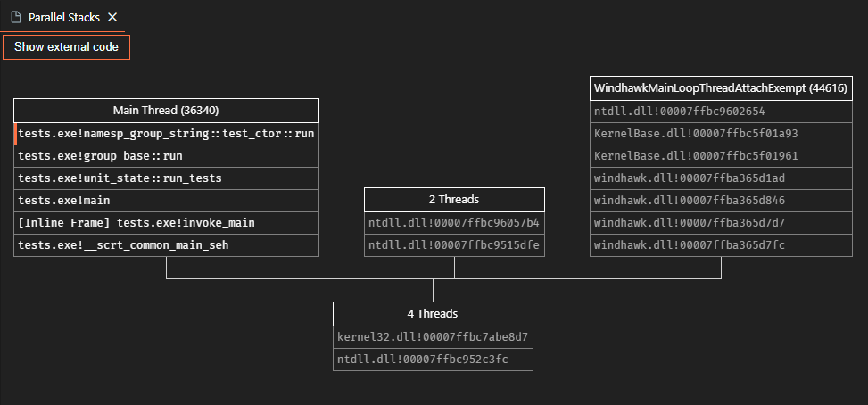
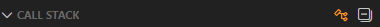

# Parallel Stacks

The extensions adds a window to display a Parallel Stacks of the currently debugged program (Similar to the [Parallel Stacks](https://learn.microsoft.com/en-us/visualstudio/debugger/using-the-parallel-stacks-window?view=visualstudio) in Visual Studio).

Example of the Parallel Stacks view.

## Features

The view displays a graph of threads grouped by callstacks, when the program is paused.

- **Compatible with all debuggers**: The view use custom Debug Adapter Protocol requests to retrieve information. All debugger implementing the protocol should work.
- **Sync with editor**: Navigating in the callstack or stepping in the code automatically updates the view.
- **Show external code**: Hide code created by third party (such as external libraries) to focus on debugging your code.
- **Navigate from the view**: Clicking on a function will open the file and go to the function line (if the file exists locally).

The view is accessible either by using the `Parallel Stacks: Show` command, either by clicking the icon added in the callstack menu bar.

## Limitations

- The extension rely heavily on what the Debug Adapter for the session gives when asking threads. If the Debug Adapter returns bad or incomplete information, the graph may have incoherency
- Clicking on a function only takes you to the active line, but doesn't move the debugger to the execution of the line. This is a limitation in the VS Code Extension API, that doesn't allow changing the active stack frame of the debug session.
